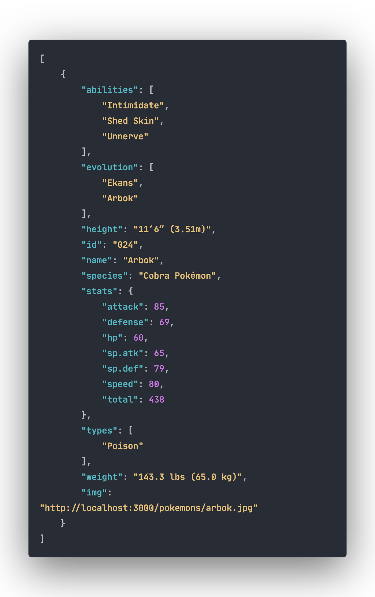
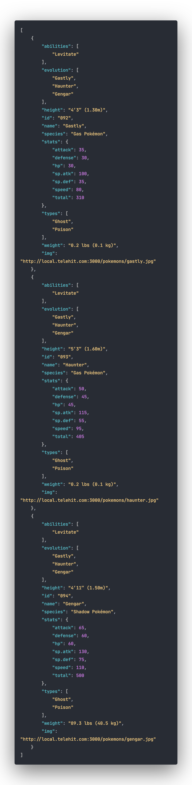
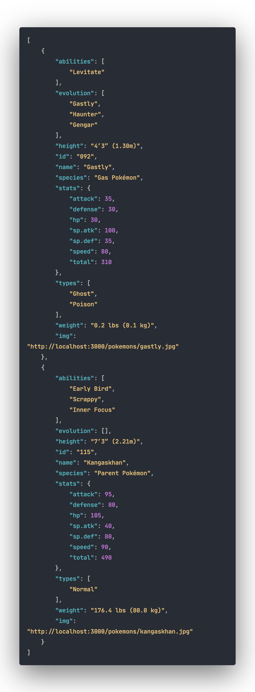

[](https://badge.fury.io/gh/OrcaPracticas%2Fapi-pokemon)

[](https://orca-api-pokemon.herokuapp.com/)


# 💻 Api de pokémon con Express

Desarrollo básico de una api utilizando `Express-js` como servidor base, el presente repositorio cuenta con un listado de `tag`s` que permite identificar puntos claves durante el desarrollo.

## 🧰 Pre-requisitos

Para poder iniciar el proyecto se necesita contar con las siguientes instalaciones.

- **[NodeJS](https://nodejs.org/en/download/) :** es un entorno en tiempo de ejecución multiplataforma, de código abierto, para la capa del servidor basado en el lenguaje de programación _ECMAScript_.

- **[Yarn](https://classic.yarnpkg.com/en/docs/install#debian-stable) :** Es un tipo de instalador de paquetes JavaScript y gestor de dependencias lanzado por _Facebook_.

> **🔖 Nota :** Se recomiendo descargar las versiones **LTS** (Long-Term Support).

## ⚙️ Instalación

### 🚶🏻‍♂️Paso 1

Iniciaremos clonando el presente repositorio para este lo podemos hacer de dos maneras.

- Cunado no se esta utilizando una llave `SSH`

```bash
    git clone https://github.com/OrcaPracticas/api-pokemon.git
```

- Cunado se esta utilizando una llave `SSH`

```bash
    git clone git@github.com:OrcaPracticas/api-pokemon.git
```

> **🔖 Nota :** En caso de que no sepas como configurar una llave SSH pues ver el siguiente articulo **[Connecting to GitHub with SSH](https://help.github.com/en/github/authenticating-to-github/connecting-to-github-with-ssh)**

### 🚶🏻‍♂Paso 2

Al terminar de clonar el repositorio nos posicionaremos en el directorio que se genero.

```bash
    cd ./pi-pokemon
```

### 🚶🏻‍♂️Paso 3

Al estar en el directorio indicado, procederemos a realizar la instalación de dependencias esta acción la podemos realizar de 2 maneras.

- Usando yarn

```bash
    yarn install
```

- Usando npm

```bash
    npm i
```

al terminar la instalación de las dependencias procederemos a correr la aplicación.

> **🔖 Nota :** Realmente [yarn](https://yarnpkg.com/getting-started) puede ser opcional, pero seria bueno que lo revisaras en el caso de que no lo conozcas.

### 🚶🏻‍♂️Paso 4

Para poder correr la aplicación se pueden utilizar 2 opciones las cuales son.

#### 🛠 Desarrollo

Este es utilizado cuando estamos en el proceso de desarrollo del aplicativo por lo cual para esta opción s muy encontrar cosas como `nodemon` el cual nos permite refrescar el código conforme generemos cambios, el comando que se utilizaremos es.

- Usando yarn

```bash
    yarn dev
```

- Usando npm

```bash
    npm run dev
```

#### 🖥 Producción

Este es utilizado cuando el desarrollo esta listo para salir a la luz prácticamente se realizara la publicación.

- Usando yarn

```bash
    yarn start
```

- Usando npm

```bash
    npm start
```

> **🔖 Nota :** Podrás ver el api en la ruta **<http://localhost:3000>** esta listara los primeros 150 pokémons.

### 🚶🏻‍♂️Paso 5

Al tener el servidor arriba podremos realizar pruebas de todo lo que nos ofrece el `Api`,

- **⚙️random :** Facilita la data de un pokémon de manera aleatoria, por ejemplo. **<http://localhost:3000/api/random>**, al correr este comando podrás ver algo como esto (existe un nodo llamado `img` el cual te muestra una imagen referente al pokémon).

    

- **⚙️type :** Realiza el filtro de los pokémon por tipo. **<http://localhost:3000/api/type/ghost>**, al correr este comando podrás ver algo como esto.



- **⚙️name :** Permite buscar pokémons por nombre completo o por incidencias. **<http://localhost:3000/api/name/char>**, al correr este comando podrás ver algo como esto.



> **🔖 Nota :** Cada método a consultar tiene que seguir la estructura `/api/[método]/[parámetro]`.

## 📦 Deployment

Es importante mencionar que el proyecto cuenta con `tag's` que facilita el movimiento entre las etapas del desarrollo realizado.

- **[⚙️Configuración y Seteo inicial](https://github.com/OrcaPracticas/api-pokemon/tree/V1.0.0)**
- **[✅Integracion de api terminada](https://github.com/OrcaPracticas/api-pokemon/tree/V1.1.0)**
- **[🧪Integración de test](https://github.com/OrcaPracticas/api-pokemon/tree/v1.2.0)**

Cada una de las faces correspondientes al desarrollo, con su **Release** el cual tiene relación con un **Pull-Request** el cual su vez tiene relación con un **Milestone** el cual tienen relación con **Issues** y estos tienen relacionados los **commits**.

## 🛠 Construido con

Para el desarrollo del presente proyecto se utilzan las siguientes dependnecias 

[](https://www.npmjs.com/package/cli-color)
[](https://www.npmjs.com/package/compression)
[](https://www.npmjs.com/package/cors)
[](https://www.npmjs.com/package/express)
[](https://www.npmjs.com/package/helmet)


[](https://www.npmjs.com/package/@babel/cli)
[](https://www.npmjs.com/package/@babel/core)
[](https://www.npmjs.com/package/@babel/preset-env)
[](https://www.npmjs.com/package/@babel/register)
[](https://www.npmjs.com/package/babel-plugin-inline-json-import)
[](https://www.npmjs.com/package/babel-plugin-module-resolver)
[](https://www.npmjs.com/package/babel-preset-minify)
[](https://www.npmjs.com/package/chai)
[](https://www.npmjs.com/package/chai-http)
[](https://www.npmjs.com/package/mocha)
[](https://www.npmjs.com/package/nodemon)
[](https://www.npmjs.com/package/nyc)


## Autores ✒️

* **[Jorge Mendez Ortega](https://github.com/OrcaPracticas)**

## Licencia 📄

Este proyecto está bajo la Licencia MIT mira el archivo [LICENSE](LICENSE) para detalles.

⌨️ con ❤️ por [Konami12](https://github.com/konami12) 😊.